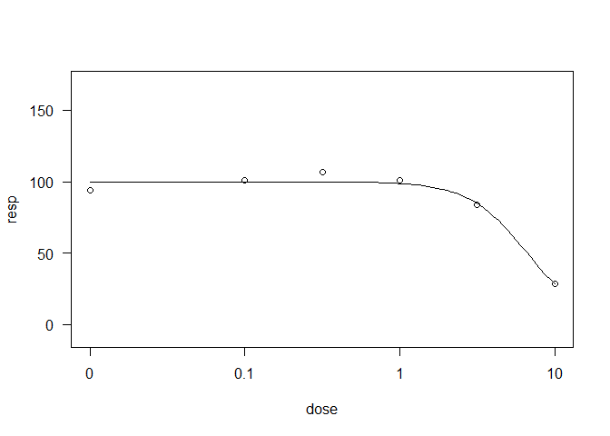

Time-Dose Two-parameter Log-Logistic Model (td2pLL)
================

<!-- badges: start -->
<!-- badges: end -->

The goal of td2pLL is to fit and display time-dose two-parameter
log-logistic (td2pLL) models to appropriate data, e.g. cytotoxicity
data. The td2pLL model is defined as

 = 100-100\frac{d^h}{ED_{50}(t)^h + d^h}
")

with


## Installation

``` r
# install.packages("devtools")
devtools::install_github("jcduda/td2pLL")
```

## Example 1: Plot a td2pLL model fit

``` r
library(td2pLL)
data(cytotox)
# Use subset of compound ASP
data_subset <- cytotox[cytotox$compound == "ASP", c("expo", "dose", "resp")]
colnames(data_subset)[1] <- "time"
fit <- fit_td2pLL(data = data_subset)
# In your Viewer in R Studio, you will see this when uncommenting the following line
# plot(fit)
```


``` r
# change scale of dose axis to linear scale, so that dose=0 can be displayed: 
# plot(fit, xaxis_scale = "linear")
# uncommenting the above line will show you the following in the Viewer or R Studio
```


``` r
# Details on fit:
summary(fit)
```

    ## 
    ## Formula: resp_m ~ 100 - 100 * (dose^h)/((delta * time^(-gamma) + c0)^h + 
    ##     dose^h)
    ## 
    ## Parameters:
    ##       Estimate Std. Error t value Pr(>|t|)   
    ## h       2.8860     0.7195   4.011  0.00129 **
    ## delta   5.9183     1.9310   3.065  0.00840 **
    ## gamma   1.7779     1.5984   1.112  0.28475   
    ## c0      4.8002     1.3460   3.566  0.00310 **
    ## ---
    ## Signif. codes:  0 '***' 0.001 '**' 0.01 '*' 0.05 '.' 0.1 ' ' 1
    ## 
    ## Residual standard error: 35.86 on 14 degrees of freedom
    ## 
    ## Algorithm "port", convergence message: relative convergence (4)

``` r
# Calculate ED50 values at different (exposure) times:
td2pLL:::get_ED50s(coefs = coef(fit), times = c(1, 2, 3))
```

    ##   time      ED50
    ## 1    1 10.718467
    ## 2    2  6.525970
    ## 3    3  5.639464

## Example 2: Use two-step pipeline for conditional time-dose modeling

If you are not sure if you need to model time-dependency, you can use
the two-step anova-based pipeline using `TDR()`. In an initial step, via
nested anova it is checked if the time has an influence. Specifically, a
2pLL model with upper and lower limit set to 100 and 0, respectively,
that ignores the epxosure time component is the null model. The full
model is a 2pLL model where for each exposure time, a different

parameter is fitted. Only the
 parameter is shared
across exposure times. If the anova test between these nested models is
significant, an effect of the exposure time is assumed to be true. In
thas case, a td2pLL model is fitted in the second step, the modeling
step. If the pre-test does not yield a significant result, then the
regualr 2pLL model with upper and lower limit 100 and 0, respectively,
is fitted.

For the data of the above chosen compound, ASP, no influence of the
exposure time on the viability was detected.

``` r
TDR_res <- TDR(data = data_subset)
TDR_res
```

    ## $pretest
    ## $pretest$signif
    ## [1] FALSE
    ## 
    ## $pretest$alpha
    ## [1] 0.05
    ## 
    ## $pretest$anova
    ## ANOVA table
    ## 
    ##           ModelDf    RSS Df F value p value
    ## 1st model     248  86851                   
    ## 2nd model     246 280281  2 -84.886   1.000
    ## 
    ## $pretest$conv
    ## [1] TRUE
    ## 
    ## 
    ## $fit
    ## 
    ## A 'drc' model.
    ## 
    ## Call:
    ## drc::drm(formula = resp ~ dose, data = data, fct = drc::LL2.2(upper = 100),     control = drc::drmc(method = "Nelder-Mead"))
    ## 
    ## Coefficients:
    ## b:(Intercept)  e:(Intercept)  
    ##         2.291          1.894

``` r
plot(TDR_res$fit)
```

<!-- -->

If we instead look at the measurements for the CHL compound, the
pre-test suggests to model the time-dependency.

``` r
data_subset <- cytotox[cytotox$compound == "CHL", c("expo", "dose", "resp")]
colnames(data_subset)[1] <- "time"
TDR_res <- TDR(data = data_subset)
TDR_res$pretest
```

    ## $signif
    ## [1] TRUE
    ## 
    ## $alpha
    ## [1] 0.05
    ## 
    ## $anova
    ## ANOVA table
    ## 
    ##           ModelDf   RSS Df F value p value
    ## 1st model     214 92795                   
    ## 2nd model     212 75240  2  24.731   0.000
    ## 
    ## $conv
    ## [1] TRUE

``` r
# plot(TDR_res$fit)
```
