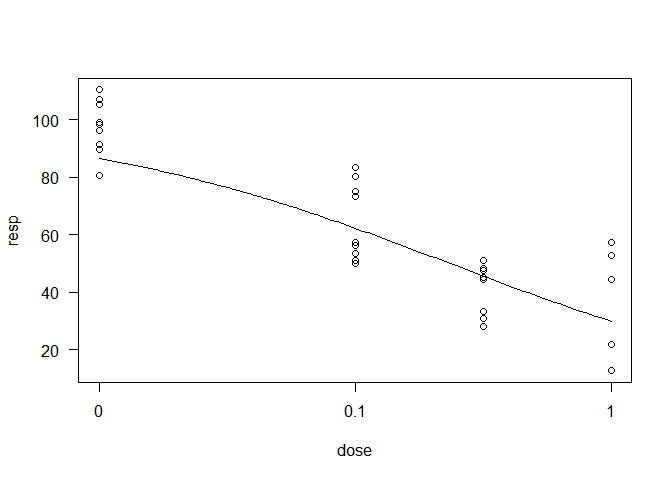
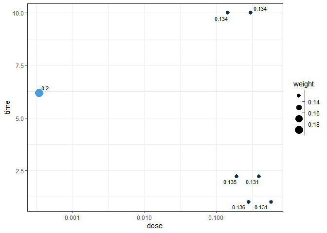
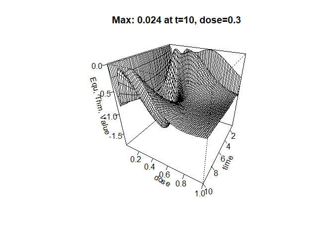

Time-Dose Two-parameter Log-Logistic Model (td2pLL)
================

<!-- badges: start -->
<!-- badges: end -->

The goal of td2pLL is to fit and display time-dose two-parameter
log-logistic (td2pLL) models to appropriate data, e.g. cytotoxicity data
and to calculate D-optimal designs for experimental planning. The td2pLL
model is defined as

 = 100-100\frac{d^h}{ED_{50}(t)^h + d^h}
")

with


## Installation

``` r
# install.packages("devtools")
devtools::install_github("jcduda/td2pLL")
```

## Example 1: Plot a td2pLL model fit

``` r
library(td2pLL)
library(dplyr)
#> 
#> Attaching package: 'dplyr'
#> The following objects are masked from 'package:stats':
#> 
#>     filter, lag
#> The following objects are masked from 'package:base':
#> 
#>     intersect, setdiff, setequal, union
data(cytotox)
# Use subset of compound ASP
data_subset <- cytotox[cytotox$compound == "ASP", c("expo", "dose", "resp")]
colnames(data_subset)[1] <- "time"
fit <- fit_td2pLL(data = data_subset)
# In your Viewer in R Studio, you will see this when uncommenting the following line
# plot(fit)
```


``` r
# change scale of dose axis to linear scale, so that dose=0 can be displayed: 
# plot(fit, xaxis_scale = "linear")
# uncommenting the above line will show you the following in the Viewer or R Studio
```


``` r
# Details on fit:
summary(fit)
#> 
#> Formula: resp_m ~ 100 - 100 * (dose^h)/((delta * time^(-gamma) + c0)^h + 
#>     dose^h)
#> 
#> Parameters:
#>       Estimate Std. Error t value Pr(>|t|)   
#> h       2.8878     0.7206   4.007  0.00130 **
#> delta   5.9221     1.9319   3.065  0.00839 **
#> gamma   1.7714     1.5939   1.111  0.28513   
#> c0      4.7963     1.3508   3.551  0.00320 **
#> ---
#> Signif. codes:  0 '***' 0.001 '**' 0.01 '*' 0.05 '.' 0.1 ' ' 1
#> 
#> Residual standard error: 35.86 on 14 degrees of freedom
#> 
#> Number of iterations to convergence: 11 
#> Achieved convergence tolerance: 1.49e-08
# Calculate ED50 values at different (exposure) times:
get_ED50s(coefs = coef(fit), times = c(1, 2, 3))
#>   time      ED50
#> 1    1 10.718380
#> 2    2  6.531001
#> 3    3  5.642143
```

## Example 2: Use two-step pipeline for conditional time-dose modeling

If you are not sure if you need to model time-dependency, you can use
the two-step anova-based pipeline using `TDR()`. In an initial step, via
nested anova it is checked if the time has an influence. Specifically, a
2pLL model with upper and lower limit set to 100 and 0, respectively,
that ignores the epxosure time component is the null model. The full
model is a 2pLL model where for each exposure time, a different

parameter is fitted. Only the
 parameter is shared
across exposure times. If the anova test between these nested models is
significant, an effect of the exposure time is assumed to be true. In
thas case, a td2pLL model is fitted in the second step, the modeling
step. If the pre-test does not yield a significant result, then the
regualr 2pLL model with upper and lower limit 100 and 0, respectively,
is fitted.

For the data of the above chosen compound, ASP, an influence of the
exposure time on the viability was detected.

``` r
TDR_res <- TDR(data = data_subset)
TDR_res
#> $pretest
#> $pretest$signif
#> [1] TRUE
#> 
#> $pretest$alpha
#> [1] 0.05
#> 
#> $pretest$anova
#> ANOVA table
#> 
#>           ModelDf   RSS Df F value p value
#> 1st model     248 86851                   
#> 2nd model     246 72544  2  24.258   0.000
#> 
#> $pretest$conv
#> [1] TRUE
#> 
#> 
#> $fit
#> Nonlinear regression model
#>   model: resp_m ~ 100 - 100 * (dose^h)/((delta * time^(-gamma) + c0)^h +     dose^h)
#>    data: data_w
#>     h delta gamma    c0 
#> 2.888 5.922 1.771 4.796 
#>  weighted residual sum-of-squares: 18004
#> 
#> Number of iterations to convergence: 11 
#> Achieved convergence tolerance: 1.49e-08
# Uncomment to see in Viewer
#plot(TDR_res$fit)
```

If we instead look at the measurements for the BOS compound and reduce
the data set a bit to a more realistic size, the pre-test suggests to
NOT model the time-dependency.

Note that if the data set is large enough, the anova pre-test will
always propose to model the time-effect as it will always find a
significant (but possibly irrelevant) difference in

values between exposure periods.

This significance-vs-relevance problem is always present in classical
frequentist statistical hypothesis testing.

``` r
data_subset <- cytotox[cytotox$compound == "BOS" &
                         cytotox$dose %in% c(0, 0.1, 0.316, 1),
                       c("expo", "dose", "resp")]
data_subset <- data_subset %>% group_by(expo, dose) %>%
  dplyr::filter(dplyr::row_number() <= 3)
colnames(data_subset)[1] <- "time"
TDR_res <- TDR(data = data_subset)
TDR_res$pretest
#> $signif
#> [1] FALSE
#> 
#> $alpha
#> [1] 0.05
#> 
#> $anova
#> ANOVA table
#> 
#>           ModelDf    RSS Df F value p value
#> 1st model      31 5098.4                   
#> 2nd model      29 4555.7  2  1.7273  0.1955
#> 
#> $conv
#> [1] TRUE
plot(TDR_res$fit, type = "all")
```



## Example 3: D-optimal design

Optimal design theory is highly developed and also well established in
pharmaceutical dose-finding studies.

For a D-optimal design of a td2pLL models, we no longer assume the
response-mean at control to be known(
=100). This has
the effect that the optimal design proposes to have experiments at the
control (dose=0), which cannot be dismissed in practical application.

One can choose, however if the response-level for infitiely large doses
should be assumed to be known
(e.g. 
for response=0 for large doses).

If it is assumed to be known, the resulting optimal design will **not**
propose to measure at these high doses, as the response is assumed known
there and measurements at these high doses would not help to gain
further knowledge about the dose-time-response relationship.

The numerical back-bone is the Imperialist Competitive Algorithm (ICA)
by Masoudi et al. (2017).

It will take a few minutes to be calculated. Change to `trace=TRUE` to
follow the optimization process.

``` r
td_opt_1 <- td_opt(param = c(h = 2, delta = 0.2, gamma = 1.3, c0 = 0.2),
                   Emax_known = TRUE, 
                   # lower limit for time and dose
                   lx = c(1, exp(-8)),
                   # upper limit for time and dose
                   ux = c(10, 1),
                   # Choose trace=TRUE to follow the optimization process
                   ICA.control = list(ncount = 200, rseed = 1905, trace = FALSE,
                                      plot_cost = FALSE),
                   iter = 400)
td_opt_1
#> 
#> Finding  locally optimal designs 
#> 
#> Call:
#> FIM defined directly via the argument 'fimfunc'
#> 
#>     iter      x11      x12      x13      x14      x15      x16      x17
#> 1      1 4.138584 7.012220 2.308482 2.191634 9.622525 1.261818 2.437718
#> 45    45 9.708916 7.249875 1.001326 9.986133 6.656873 2.016469 2.771030
#> 89    89 9.923456 6.222053 1.000843 9.999907 7.961634 2.138536 2.212301
#> 134  134 9.997058 8.783593 1.000514 9.998855 7.364888 2.225970 2.133411
#> 178  178 9.999960 9.999906 7.173289 2.170807 2.197950 1.000012 1.000178
#> 222  222 9.999953 9.999596 7.001495 2.290375 2.200514 1.000033 1.000502
#> 267  267 9.999988 9.999990 6.487688 2.181538 2.220997 1.000002 1.000006
#> 311  311 9.999998 9.999983 6.482994 2.208655 2.226023 1.000001 1.000002
#> 355  355 9.999981 9.999984 6.490644 2.221738 2.216644 1.000001 1.000032
#> 400  400 9.999993 9.999971 6.197040 2.219562 2.224337 1.000001 1.000001
#>            x21          x22          x23       x24       x25       x26
#> 1   0.04281632 0.4585485024 0.9081370497 0.1561994 0.2875296 0.4121813
#> 45  0.35368453 0.0061719561 0.3819896601 0.1374555 0.9852946 0.3334163
#> 89  0.32037638 0.0006030829 0.3986069542 0.1378312 0.9712651 0.4287708
#> 134 0.32150889 0.0003485619 0.3988487362 0.1377556 0.9717666 0.4116065
#> 178 0.13611805 0.3053410580 0.0003687687 0.1885288 0.4155264 0.3717006
#> 222 0.14710744 0.2946562852 0.0004140470 0.1881522 0.4154639 0.2965777
#> 267 0.14766975 0.2949168021 0.0003606696 0.1917453 0.4075099 0.2961824
#> 311 0.14615216 0.2969128030 0.0003358833 0.1917543 0.4016589 0.2951038
#> 355 0.14436923 0.2997571716 0.0003538701 0.1917005 0.3926499 0.2839684
#> 400 0.14485520 0.3007812155 0.0003402247 0.1916492 0.3919636 0.2818543
#>           x27        w1          w2        w3        w4         w5         w6
#> 1   0.4901258 0.1242865 0.008285996 0.1766775 0.1200667 0.27706385 0.11275927
#> 45  0.1932682 0.2145677 0.142475930 0.2225141 0.1932950 0.01819131 0.09562984
#> 89  0.1649050 0.1493164 0.179821332 0.1859809 0.1715867 0.01039963 0.18235154
#> 134 0.1746463 0.1414627 0.189339726 0.1933476 0.1546359 0.00555770 0.16139973
#> 178 0.7059428 0.1369352 0.144814200 0.2113392 0.1483880 0.12958422 0.18124791
#> 222 0.6098555 0.1269629 0.125511960 0.2086322 0.1324518 0.11236451 0.16598775
#> 267 0.6086189 0.1306511 0.124139352 0.1983130 0.1425094 0.13352715 0.14376866
#> 311 0.6053688 0.1311783 0.132611160 0.1970448 0.1371726 0.13152605 0.14728062
#> 355 0.5801628 0.1300940 0.137447673 0.2012438 0.1344885 0.13147424 0.14029508
#> 400 0.5767679 0.1338137 0.134152946 0.1997585 0.1348531 0.13113991 0.13574009
#>             w7  min_cost mean_cost
#> 1   0.18086020 -19.85208 -18.23572
#> 45  0.11332605 -21.85848 -21.64439
#> 89  0.12054353 -22.01560 -21.88176
#> 134 0.15425672 -22.06388 -21.96463
#> 178 0.04769122 -22.08616 -22.01238
#> 222 0.12808880 -22.09886 -22.04714
#> 267 0.12709140 -22.11651 -22.07441
#> 311 0.12318645 -22.11860 -22.08809
#> 355 0.12495679 -22.12097 -22.08951
#> 400 0.13054175 -22.12167 -22.09035
#> 
#> Optimal designs (k=7):
#>   Points1   Points2   Points3   Points4   Points5   Points6   Points7 
#>  /9.99999\ /9.99997\ /6.19704\ /2.21956\ /2.22434\ /1.00000\ /1.00000\
#>  \0.14486/ \0.30078/ \0.00034/ \0.19165/ \0.39196/ \0.28185/ \0.57677/
#>  Weights1  Weights2  Weights3  Weights4  Weights5  Weights6  Weights7 
#>    0.134     0.134     0.200     0.135     0.131     0.136     0.131  
#> 
#>  ICA iteration: 400
#>  Criterion value:  -22.12167
#>  Total number of function evaluations: 115883
#>  Total number of successful local search moves: 33159
#>  Total number of successful revolution moves: 576
#>  Convergence: Maximum_Iteration
#>  Total number of successful assimilation moves: 10293
#>  CPU time: 79.64  seconds!
```

The final design contains 7 time-dose points, where one will be placed
at the smallest dose-value with weight 0.2. The smallest dose-level can
be interpreted as dose=0.

If desired, this point can be splitted along the time-axis. This means
that instead of having 20 % of observations at dose = 0 and time = 6.2,
one can euivalently choose

-   20/3 % at dose = 0 and time = 1
-   20/3 % at dose = 0 and time = 10 and
-   20/3 % at dose = 0 and time = 2.2.

``` r
plot_td_des(td_opt_1)
```

 One
can check if the design is indeed optimal with a sensitivity plot. If
the entire plot is approximately below 0 at all points in the design
space and approximately zero at the proposed design points, then the
design is D-optimal for the assumed paramter.

``` r
plot_td_dcrit_equ(td_opt_1, 
                  # to rotate the plot
                  plot_phi = 30)
```


