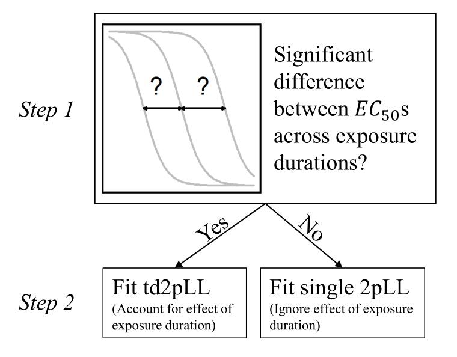

```{r, include = FALSE}
knitr::opts_chunk$set(
  collapse = TRUE,
  comment = "#>"
)
```

## Introduction

This package aims at modeling time-dose-response cytotoxicity data and retrieve
target concentrations at different setting for dose and time.
td2pLL means *time-dose-two-parameter-log-logistic* model. 

The td2pLL model is defined as 

\[
f(t, d) = 100-100\frac{d^h}{ED_{50}(t)^h + d^h}
\]


with

\[
ED_{50} =\Delta \cdot t^{-\gamma} + C_0 .
\]


For cytotoxicity data, dose is likely a concentrations and time is likely an exposure duration.

## Installation


```{r setup}
# install.packages("devtools")
# devtools::install_github("jcduda/td2pLL")
library(td2pLL)
```

## Example 1: Plot a td2pLL model fit

The data set `cytotox` is stored in the td2pLL package and is the experimental data of Gu et al. (2018)[ [doi](https://doi.org/10.1007/s00204-018-2302-0)].


```{r example1}
library(td2pLL)
library(dplyr)
data(cytotox)
# Use subset of compound ASP
data_subset <- cytotox[cytotox$compound == "ASP", c("expo", "dose", "resp")]
colnames(data_subset)[1] <- "time"
fit <- fit_td2pLL(data = data_subset)
# In your Viewer in R Studio, you will see this when uncommenting the following line
# plot(fit)
```


Use `summary()` to get information on the model fit.
```{r}
summary(fit)
```


Change scale of dose axis to linear scale, so that dose=0 can be displayed: 
```{r example_linear}
# Uncommenting the above line will show you the following in the Viewer or R Studio
# plot(fit, xaxis_scale = "linear")
```


## Retrieve EC50 values at selected exposure durations

```{r details}
get_ED50s(coefs = coef(fit), times = c(1, 2, 3))
```


## Example 2: Use two-step pipeline for conditional time-dose modeling


```{r, out.width = "400px", fig.pos="center", echo = FALSE}

```


If you are not sure if you need to model time-dependency, you can use the
two-step anova-based pipeline using `TDR()`.

In an initial step, via nested anova it is checked if the time has an influence.
Specifically, a 2pLL model with upper and lower limit set to 100 and 0, respectively,
that ignores the epxosure time component is the null model.
The full model is a 2pLL model where for each exposure time, a different
$ED_{50}$ parameter is fitted. Only the $h$ parameter is shared across exposure 
times.

If the anova test between these nested models is significant, an effect of the
exposure time is assumed to be true. 
In thas case, a td2pLL model is fitted in the second step, the modeling step.
If the pre-test does not yield a significant result, then the regualr 2pLL model
with upper and lower limit 100 and 0, respectively, is fitted.


For the data of the above chosen compound, ASP, an influence of the
exposure time on the viability was detected.

```{r}
TDR_res <- TDR(data = data_subset)
TDR_res
# Uncomment to see in Viewer
#plot(TDR_res$fit)
```

If we instead look at the measurements for the BOS compound and reduce
the data set a bit to a more realistic size, the pre-test
suggests to *not* model the time-dependency.
Therefore, only a one-dimensionl 2pLL model is fitted.

Note that if the data set is large enough, the anova pre-test will
always propose to model the time-effect as it will always find a
significant (but possibly irrelevant) difference in $ED_{50}$ values
between exposure periods.

This significance-vs-relevance problem is always present in 
classical frequentist statistical hypothesis testing.

```{r}
data_subset <- cytotox[cytotox$compound == "BOS" &
                         cytotox$dose %in% c(0, 0.1, 0.316, 1),
                       c("expo", "dose", "resp")]
data_subset <- data_subset %>% group_by(expo, dose) %>%
  dplyr::filter(dplyr::row_number() <= 3)
colnames(data_subset)[1] <- "time"
TDR_res <- TDR(data = data_subset)
TDR_res$pretest
```


```{r, fig.width=6, fig.height=4}
plot(TDR_res$fit, type = "all")
```

When only a 2pLL model is fitted, the function `drc::drm()` is used.
In the `drc` R-package, the $b$ parameter is thesteepness parameter and the
$e$ parameter is $\log(EC_{50})$.

```{r}
summary(TDR_res$fit)
```

